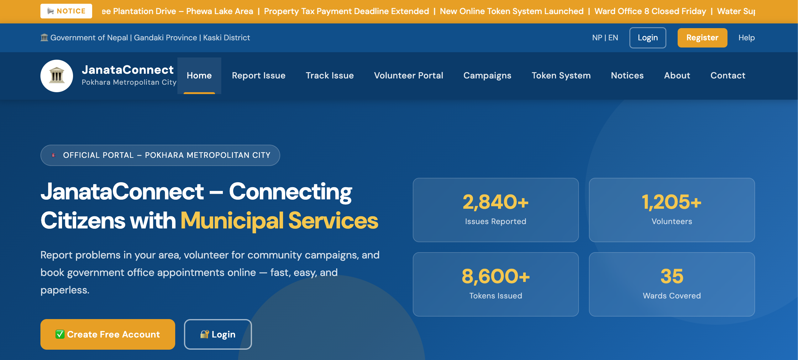
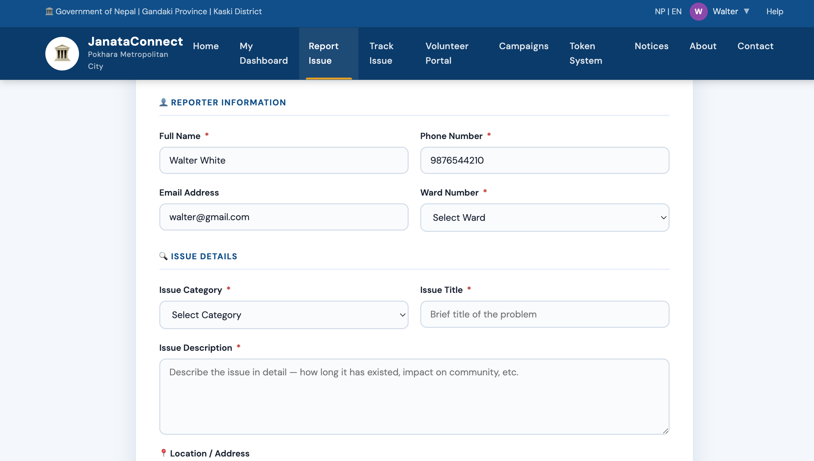
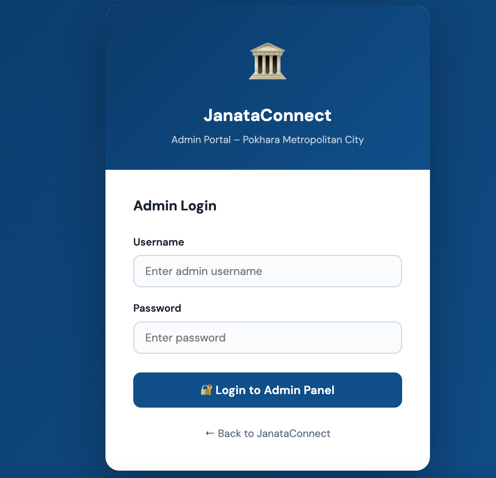

# 🏛️ JanataConnect

### Official Citizen Services Portal — Pokhara Metropolitan City, Nepal

A full-stack municipal services web application connecting citizens with local government services. Built with PHP, MySQL, HTML, CSS, and JavaScript.

This project was developed as a personal learning initiative to build a full-stack municipal services platform using PHP and MySQL.

---

## 📋 Features

### Citizen-Facing Portals

| Portal                     | Description                                                                              |
| -------------------------- | ---------------------------------------------------------------------------------------- |
| **Homepage**               | Hero section, 3 service cards, live notices ticker, how-it-works steps                   |
| **Issue Reporting**        | Report road damage, waste issues, street lights, water supply problems with photo upload |
| **Volunteer Registration** | Register for community campaigns with skill selection and availability                   |
| **Token System**           | Book digital queue tokens for 7+ government offices, get instant token numbers           |
| **About**                  | Municipal info, department overview, key facts                                           |
| **Contact**                | Office contacts, emergency numbers, contact form                                         |

### Admin Panel (`/admin/`)

| Page                 | Description                                                                |
| -------------------- | -------------------------------------------------------------------------- |
| **Dashboard**        | Live stats (issues, volunteers, tokens), recent activity tables            |
| **Issues**           | Full table with search/filter by status, inline status update, detail view |
| **Issue Detail**     | Full issue info, photo, reporter contact, prev/next navigation             |
| **Volunteers**       | Full table with search, skill badges, detail view                          |
| **Volunteer Detail** | Full profile — skills, availability, experience, emergency contact         |
| **Tokens**           | Full table with date and name/office search filter                         |

---

## 🗂️ Project Structure

```
janataconnect/
├── index.php                    ← Homepage
├── report_issue.php             ← Issue reporting portal
├── volunteer_register.php       ← Volunteer registration portal
├── token_system.php             ← Digital token booking portal
├── about.php                    ← About page
├── contact.php                  ← Contact page
├── database.sql                 ← Database schema + sample data
├── .htaccess                    ← Security & PHP config
│
├── css/
│   └── style.css                ← Full design system with CSS variables
│
├── js/
│   └── main.js                  ← Navbar toggle, form UX, toast notifications
│
├── config/
│   ├── db.php                   ← MySQL connection settings
│   └── .htaccess                ← Deny direct access to config files
│
├── includes/
│   ├── header.php               ← Shared navbar + notice ticker (auto-detects admin)
│   └── footer.php               ← Shared footer with municipality info
│
├── admin/
│   ├── login.php                ← Admin login
│   ├── logout.php               ← Session destroy + redirect
│   ├── auth_check.php           ← Session guard (include in every admin page)
│   ├── dashboard.php            ← Overview dashboard
│   ├── issues.php               ← Manage all issues
│   ├── issue_detail.php         ← Single issue detail view
│   ├── volunteers.php           ← Manage all volunteers
│   ├── volunteer_detail.php     ← Single volunteer profile view
│   ├── tokens.php               ← Manage all token bookings
│   └── update_status.php        ← AJAX endpoint for status updates
│
└── uploads/
    └── .htaccess                ← Block PHP execution in uploads folder
```

---

## ⚙️ Setup Instructions

### Requirements

- PHP 7.4+ (PHP 8.x recommended)
- MySQL 5.7+ or MariaDB 10.3+
- Apache with `mod_rewrite` (XAMPP, WAMP, LAMP, or cPanel)

### Step 1 — Database Setup

1. Open **phpMyAdmin** or your MySQL client
2. Create a new database called `janataconnect`
3. Import `database.sql` — this creates all tables and adds sample data

```sql
CREATE DATABASE janataconnect;
USE janataconnect;
-- then run database.sql
```

### Step 2 — Configure Database Connection

Edit `/config/db.php` with your credentials:

```php
define('DB_HOST', 'localhost');     // usually localhost
define('DB_USER', 'root');          // your MySQL username
define('DB_PASS', 'root');              // your MySQL password
define('DB_NAME', 'janataconnect'); // database name
```

### Step 3 — File Permissions

Ensure the uploads folder is writable:

```bash
chmod 755 uploads/
# or on shared hosting:
chmod 777 uploads/
```

### Step 4 — Access the Site

- **Homepage:** `http://localhost/janataconnect/`
- **Admin Login:** `http://localhost/janataconnect/admin/login.php`

### Step 5 — Admin Credentials

Default login :

- **Username:** `admin`
- **Password:** `admin123`

To change the password, generate a new bcrypt hash in PHP:

```php
echo password_hash('your_new_password', PASSWORD_BCRYPT);
```

Then update the `admin_users` table with the new hash.

---

## 🗄️ Database Schema

### `issues`

| Column      | Type               | Description                      |
| ----------- | ------------------ | -------------------------------- |
| id          | INT AUTO_INCREMENT | Primary key                      |
| name        | VARCHAR(120)       | Reporter's full name             |
| phone       | VARCHAR(20)        | Contact number                   |
| email       | VARCHAR(120)       | Email (optional)                 |
| ward        | VARCHAR(10)        | Ward number                      |
| category    | VARCHAR(60)        | Issue type                       |
| title       | VARCHAR(200)       | Issue title                      |
| description | TEXT               | Detailed description             |
| location    | VARCHAR(300)       | Location/address                 |
| photo       | VARCHAR(300)       | Uploaded photo filename          |
| date        | DATE               | Date of report                   |
| status      | ENUM               | Pending / In Progress / Resolved |
| created_at  | TIMESTAMP          | Auto-set on insert               |
| updated_at  | TIMESTAMP          | Auto-updated                     |

### `volunteers`

| Column                      | Type               | Description            |
| --------------------------- | ------------------ | ---------------------- |
| id                          | INT AUTO_INCREMENT | Primary key            |
| name, dob, gender           | —                  | Personal info          |
| citizenship_no              | VARCHAR(60)        | Optional               |
| phone, email, address, ward | —                  | Contact & location     |
| skills                      | TEXT               | Comma-separated skills |
| availability_days / time    | VARCHAR            | Weekdays/Weekends/etc. |
| has_experience              | TINYINT(1)         | 1 = yes                |
| emergency_contact / phone   | —                  | Emergency details      |
| agreed                      | TINYINT(1)         | Terms accepted         |

### `tokens`

| Column             | Type               | Description                    |
| ------------------ | ------------------ | ------------------------------ |
| id                 | INT AUTO_INCREMENT | Primary key                    |
| name, phone, email | —                  | Visitor info                   |
| office             | VARCHAR(200)       | Government office              |
| service            | VARCHAR(200)       | Service type                   |
| date               | DATE               | Appointment date               |
| time_slot          | VARCHAR(30)        | Morning / Afternoon            |
| token_number       | VARCHAR(20) UNIQUE | e.g. A023, B007                |
| status             | ENUM               | Active / Completed / Cancelled |

---

## Screenshots

### Homepage



### Issue Reporting Portal



### Admin Dashboard



## 🔐 Security Notes

- Config folder is protected by `.htaccess` (deny all)
- Uploads folder blocks PHP execution
- All user inputs are escaped with `mysqli::real_escape_string()`
- Admin session guard on every admin page
- File upload restricted to images only (jpg, png, gif, webp), max 5MB
- **For production:** use prepared statements, HTTPS, and change default admin password

---

## 🎨 Design System

The CSS design system in `/css/style.css` uses CSS custom properties:

```css
--primary: #0a4d8c       /* Main blue */
--primary-dark: #073a6b  /* Dark navy */
--accent: #e8a000        /* Gold/amber */
--green: #1a7a4a         /* Success green */
--red: #c0392b           /* Error red */
```

Font: **DM Sans** (Google Fonts) with **Mukta** as fallback for Nepali-compatible text.

---

## 📞 Municipality Contact

**Pokhara Metropolitan City**
Pokhara-30, Bagar, Kaski District, Gandaki Province, Nepal
📞 061-525999 | ✉️ info@pokharametro.gov.np
🌐 www.pokharametro.gov.np

---

_Built for the Smart Pokhara Digital Governance Initiative_
